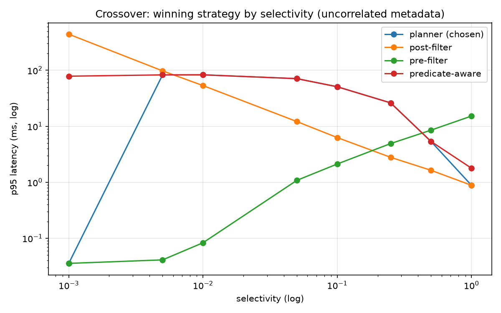

# filtered-vecdb

> A cost-based query planner for approximate nearest-neighbour search that chooses
> between pre-filtering, post-filtering, and predicate-aware graph traversal using
> estimated predicate selectivity — with a measured crossover curve showing exactly
> where each strategy wins and why.



*(SIFT, 100K vectors/128-dim, uncorrelated metadata, p95 latency in ms, log-log axes. `planner (chosen)` is the cost-model planner described below — see "What I got wrong" for why it tracks `predicate_aware`'s losing line through the middle of the chart instead of the lower envelope.)*

## Results

Numbers below are the mean recall@10, p95 latency, and mean `dist_ops` (distance computations per
query) for the three fixed strategies at three representative selectivities, taken directly from
`results/sweep_uncorrelated.csv` (100K SIFT vectors, 180 measured queries/cell after a 20-query
warmup, uncorrelated metadata).

| selectivity | strategy | recall@10 | p95 latency (ms) | dist_ops (mean) |
|---|---|---|---|---|
| 0.001 | pre_filter | 1.000 | 0.036 | 100 |
| 0.001 | post_filter | 1.000 | 440.60 | 61,774 |
| 0.001 | predicate_aware | 0.986 | 78.39 | 30,074 |
| 0.05 | pre_filter | 1.000 | 1.08 | 5,000 |
| 0.05 | post_filter | 1.000 | 12.15 | 6,242 |
| 0.05 | predicate_aware | 1.000 | 70.90 | 28,934 |
| 0.5 | pre_filter | 1.000 | 8.54 | 50,000 |
| 0.5 | post_filter | 0.992 | 1.63 | 1,178 |
| 0.5 | predicate_aware | 1.000 | 5.35 | 2,993 |

`predicate_aware` is never the fastest of the three strategies at any of the 8 selectivities in
the full sweep (the winner alternates only between `pre_filter` at low/mid selectivity and
`post_filter` at high selectivity — see the crossover chart above); it is not the slowest at
every selectivity shown above, either — e.g. at s=0.001 `post_filter` is far slower (440.60ms vs.
78.39ms), and at s=0.5 `pre_filter` is slower (8.54ms vs. 5.35ms). See "What I got wrong" for the
full picture across all 8 grid points.

*(These numbers come from the current `results/sweep_uncorrelated.csv`, regenerated in Phase 7
with the planner as a 4th executor; they differ by a few percent from numbers quoted in the
Phase 5/6 milestone docs, which were written against an earlier snapshot of this file.)*

**A cost-based query planner for approximate nearest-neighbour search that chooses between
pre-filtering, post-filtering, and predicate-aware graph traversal using an estimated predicate
selectivity — with a measured crossover curve showing exactly where each strategy wins and why.**

## Architecture

```
┌──────────────────────────────────────────────────────────────┐
│  SERVICE LAYER            FastAPI  (app.py, schemas.py)      │
│  POST /insert  POST /search  GET /stats  POST /persist       │
└───────────────────────────┬──────────────────────────────────┘
                            │  SearchRequest{q, k, filter, ef?}
┌───────────────────────────▼──────────────────────────────────┐
│  QUERY PLANNER            planner/                           │
│   1. compile predicate  → bitmask + estimated selectivity ŝ  │
│   2. cost model         → C_pre(ŝ), C_post(ŝ), C_pred(ŝ)     │
│   3. choose argmin, emit ExecutionPlan                       │
│   4. record actual cost → feed calibration log               │
└───────┬──────────────────┬──────────────────┬────────────────┘
        │                  │                  │
┌───────▼──────┐  ┌────────▼───────┐  ┌───────▼──────────────┐
│ PRE-FILTER   │  │ POST-FILTER    │  │ PREDICATE-AWARE      │
│ exact scan   │  │ HNSW + discard │  │ filtered HNSW walk   │
│ over mask    │  │ adaptive ef    │  │ 2-hop expansion      │
└───────┬──────┘  └────────┬───────┘  └───────┬──────────────┘
        │                  │                  │
┌───────▼──────────────────▼──────────────────▼────────────────┐
│  INDEX LAYER              index/                             │
│   FlatIndex (exact, ground truth)                            │
│   HNSWIndex (hand-written: layers, M, efC, heuristic prune)  │
│   shared: DistanceCounter instrumentation                    │
└───────┬──────────────────────────────────────────────────────┘
        │
┌───────▼──────────────────────────────────────────────────────┐
│  PREDICATE LAYER          predicate/                         │
│   DSL parse → AST → NumPy bool mask                          │
│   Selectivity estimator (histograms + value counts)          │
└───────┬──────────────────────────────────────────────────────┘
        │
┌───────▼──────────────────────────────────────────────────────┐
│  STORAGE LAYER            store/                             │
│   VectorStore   float32 (N,d) np.memmap + norms cache        │
│   MetaStore     columnar dict[str, np.ndarray] + stats       │
│   IdMap         external id ↔ internal row index             │
└──────────────────────────────────────────────────────────────┘
```

*(Layer diagram per source technical plan §3.1.)*

**Why hand-written HNSW instead of wrapping FAISS.** The project's stated substrate risk was
"HNSW recall stuck low" (source plan §6 risk register), with a documented fallback to wrap
`faiss.IndexHNSWFlat` if unfixed by end of Day 3. That fallback was never needed: the
hand-written `HNSWIndex` hit recall@10 = 0.9980 at `efSearch=100` on siftsmall on the first
clean build (gate required ≥ 0.95), in 31.2s (gate: < 120s). See
`docs/superpowers/milestones/03-hnsw.md`. It comes at a real, measured cost: at matched recall
(1.000, `ef=160`/`320`), the hand-written index is **~13–15x slower per query than FAISS**
(1.7–3.2ms vs. 0.12–0.25ms), not the "2–5x" the source plan sketched informally — root-caused to
Python interpreter dispatch overhead (heap push/pop, per-call `numpy.array()` construction) and
lack of SIMD/cache-friendly batching, not an algorithmic defect: recall parity at matched `ef`
shows the graph structure and beam search are correct. See
`docs/superpowers/milestones/04-tuning-scale.md`.

**Why three filter strategies.** No single execution strategy dominates across selectivity:
pre-filtering an exact O(N·s) scan is cheap when few rows survive but degenerates to a near-full
scan as `s → 1`; post-filtering (search-then-discard on the unfiltered HNSW graph) needs
`ef ≥ k/s` survivors in the beam, which explodes as `s → 0` and is probabilistic (can
under-return); predicate-aware traversal tries to have HNSW admit only matching nodes to the
result set while still traversing non-matches to preserve graph connectivity. Measuring where
each actually wins — rather than picking one on intuition — is the point of the project. See
`docs/superpowers/milestones/05-pre-post-filter.md` (pre/post) and
`docs/superpowers/milestones/06-predicate-aware-traversal.md` (predicate-aware, including why it
did not win anywhere in this implementation).

**Why a calibrated cost model.** Selectivity alone doesn't tell you which strategy is cheapest —
that depends on constants (scan throughput per row, hop cost, beam-widening behaviour) that are
implementation- and hardware-specific and have to be measured, not guessed. `c_scan`, `c_hop`,
and `beta` are fit by least squares against measured `dist_ops` from the Day 4–5 sweep and
persisted to `results/calibration.json`, so the planner's cost ranking is calibrated from this
codebase's own measurements rather than three magic numbers. Fitting against op-counts rather
than latency was deliberate — it was meant to keep the model hardware-independent — but that
same choice is also the root cause of the cost-model planner's gate failure, documented in full
in "What I got wrong" below. See `docs/superpowers/milestones/07-planner-sweep-figures.md`.

## How to run

```bash
pip install -e .
python scripts/download_data.py
python scripts/build_100k.py
python scripts/calibrate.py
python scripts/run_full_sweep.py
python scripts/generate_figures.py
uvicorn vecdb.service.app:app
```

This is the full pipeline from a clean clone: download SIFT + generate synthetic metadata, build
the 100K-vector HNSW index, fit the cost model's constants, run the 8-selectivity × 2-metadata ×
4-executor sweep (takes 30–60 minutes), regenerate the figures in `results/figures/`, then serve
the FastAPI endpoints (`POST /insert`, `POST /search`, `GET /stats`, `POST /persist`).

`pytest` from the repo root runs the full test suite. As of this writing that suite is **not**
fully green: `tests/test_planner_regret.py::test_mean_regret_is_bounded_relative_to_oracle`
fails (107 passed, 1 failed) because it tests the cost-model planner specifically, and that
planner's regret is real and large — see below. This is a known, currently-red test, not a flaky
one; it is left failing intentionally rather than loosened, per its own assertion message and
the honesty requirements of this project.

## What I got wrong / limitations

**Predicate-aware traversal (Strategy C) never won anywhere.** The Phase 6 gate — beat both
`pre_filter` and `post_filter` on p95 latency at two selectivity points in the middle of the
range — **failed**: across all 8 selectivities on both metadata variants, `predicate_aware`
never simultaneously beats both fixed strategies, not even once. Recall was never the limiting
factor (≥ 0.986 everywhere, mostly 1.000, comfortably above the 0.90 floor). A follow-up
debugging pass (documented, not hand-waved) instrumented real queries and found no
implementation bug — the break condition, two-hop trigger, and heap ordering are all correct.
The real cause is a design-level double compensation for selectivity: the beam-widening formula
(`ef_eff = ef_base · min(4, 1/max(ŝ,0.05))`) inflates the admission quota to its ceiling (256) at
low/mid selectivity, on top of the two-tier admission mechanism that *already* compensates for
scarcity by traversing through non-matches and via two-hop densification — so the search pays
for scarcity twice. A counterfactual re-run with `ef=k=10` terminated naturally, well under
budget, and returned the identical top-10 in 8/8 sampled queries: the wide beam buys zero extra
recall while dominating the cost. Full mechanism: `docs/superpowers/milestones/06-predicate-aware-traversal.md`.

**The crossover chart shows one strategy change, not the expected two.** The source plan
expected `pre_filter` to win below ~1% selectivity, `predicate_aware` to win in a ~1%–30% middle
band (uncorrelated data), and `post_filter` to win above ~30%. The measured chart instead shows
`pre_filter` winning the entire low-to-mid range (s=0.001 through s=0.1) and `post_filter`
winning the entire high range (s=0.25 through s=1.0) — **exactly one crossover**, between s=0.1
and s=0.25, because `predicate_aware` never wins the middle band it was expected to own. This
holds in both `crossover.png` (latency) and `dist_ops.png` (hardware-independent op count), and
in both metadata variants — the correlated chart is nearly identical in shape to the
uncorrelated one, because there was no predicate-aware-winning middle band to shrink in the
first place. `docs/superpowers/milestones/07-planner-sweep-figures.md`.

**The planner story has two parts — do not read either half as the whole story.**
- The **cost-model planner** (`Planner(params)` — what `crossover.png` actually plots as
  "planner (chosen)") **failed** the Phase 7 gate (`mean_planner < min(mean_fixed)`): mean
  latency **30.68ms** vs. `pre_filter`'s **3.66ms**, roughly **8x worse**, on the full
  uncorrelated sweep. Root cause: the calibrated cost formula was fit by least squares against
  `dist_ops` (deliberately, to stay hardware-independent), and it recovers a ranking that favours
  `predicate_aware` at 7 of 8 selectivity points — but `predicate_aware`'s real cost-per-op is a
  Python-level graph hop, three orders of magnitude more expensive than `pre_filter`'s single
  vectorized NumPy scan per op. Fitting op-count correctly does not guarantee the resulting
  *ranking* holds in wall-clock terms once strategies differ this much in cost-per-op.
  `tests/test_planner_regret.py` is the currently-failing test that exercises exactly this:
  mean regret 29.782ms against a 0.135ms threshold (15% of a 0.899ms oracle mean).
- A follow-up **`Planner.from_lookup_table(...)`** — the source plan's own documented
  risk-register mitigation for "cost model doesn't fit" — buckets `ŝ` and picks the empirically
  fastest strategy per bucket, fit on a calibration half of the sweep (`query_idx < 110`) and
  evaluated on the disjoint held-out half (`query_idx ≥ 110`) of `results/sweep_uncorrelated.csv`.
  On that held-out data it **passed**: mean latency **0.9046ms** vs. `pre_filter`'s **3.6410ms**,
  roughly **4x faster** — a complete reversal. This was evaluated by
  `scripts/evaluate_lookup_planner.py` as a calibration/evaluation analysis over
  already-collected sweep data, **not** by running a new 100K-scale sweep, and it is **not**
  plotted in `crossover.png` or any other figure. Full detail:
  `.superpowers/sdd/2026-08-11-filtered-vector-db/task-38-followup-report.md`.

Neither of these facts should be quoted without the other: the planner that is actually swept
and plotted failed its gate by ~8x; the plan's own documented fallback for that exact failure
mode passed on held-out data by ~4x, via a different mechanism (a lookup table, not a cost
model), on a different data slice (held-out half of an existing sweep, not a new sweep).

**FAISS latency gap is larger than the plan's informal expectation.** The source plan sketched
"2–5x" slower than FAISS as the expected cost of a NumPy implementation. Measured: **~13–15x**
slower at matched recall (1.000) on siftsmall (`ef=160`: 1.744ms vs. 0.117ms; `ef=320`: 3.178ms
vs. 0.250ms). `dist_ops` counts are close between the two at matched `ef`/recall, so this is a
constant-factor gap (interpreter dispatch, heap bookkeeping, lack of SIMD) rather than an
algorithmic one — reported honestly rather than rounded down to the plan's informal figure. See
`docs/superpowers/milestones/04-tuning-scale.md`.

**The AND-independence assumption in selectivity estimation is a measured lie, as expected.**
The estimator assumes `P(A and B) ≈ P(A)·P(B)`. Measured error on 500 random predicates: median
relative error 0.008 (uncorrelated) / 0.005 (correlated), but **p95 relative error 0.467
(uncorrelated) / 0.466 (correlated)** — a heavy tail, present in both metadata variants at
similar magnitude. (The correlated dataset's correlation is between `category` and
vector-space geometry via k-means, not between the predicate columns themselves, so it does not
stress the AND-independence assumption more than the uncorrelated variant does — that geometric
correlation is what Strategy C's traversal cares about instead.) See
`docs/superpowers/milestones/05-pre-post-filter.md`.

**Other real limitations:**
- Metadata is synthetic (SIFT ships with no attributes) — two hand-generated variants
  (uncorrelated; correlated via k-means over the vector space), not real workload correlations.
- No deletes in v1. Tombstone bitmap design is sketched (see "What I'd do next") but not built.
- No durability. Snapshot persistence via `.save()`/`.load()` only; no WAL, no crash recovery.
- Single-threaded. Search parallelises trivially across queries; build does not, without more
  work.
- `pytest` is not fully green: 107 passed / 1 failed (`test_planner_regret.py`, the cost-model
  planner's regret test, described above) as of this writing.
- Strategy B's (post-filter) fallback-to-pre-filter safety net was exercised and unit-tested
  (`test_fallback_rate_is_tracked_across_calls`) but never triggered by the real 100K sweep —
  underfill rate and fallback rate were 0.00 at all 8 selectivities on both metadata variants,
  because the default `alpha=4.0` beam-widening margin is large enough that underfill is a
  ~1e-6-probability tail event at these settings. The bounded-harm claim is proven by
  construction and by this survival-probability argument, not by an observed sweep failure.
  `docs/superpowers/milestones/05-pre-post-filter.md`.

## What I'd do next

- **Deletes**: tombstone bitmap excluded at admission, graph left intact; rebuild when the
  tombstoned fraction crosses ~20%. The hard part is that deleting a hub node damages
  connectivity for its neighbours, not just the deleted node's own edges.
- **A write-ahead log**: snapshot persistence is fine for a benchmark artifact but not for a
  service; a WAL is the obvious next step toward real durability.
- **DiskANN/Vamana at larger scale**: HNSW's random-access memory pattern is fatal once the
  index no longer fits in RAM. A flatter, SSD-resident graph (DiskANN/Vamana) plus product
  quantization for an in-memory rerank set is the standard answer at 100M+ vectors — a different
  project, not an extension of this one.
- **Multi-threaded search**: search parallelises trivially across queries (each query is
  independent, read-only graph traversal); this implementation is single-threaded throughout and
  that is left on the table.

## References

- Malkov & Yashunin, "Efficient and robust approximate nearest neighbor search using
  Hierarchical Navigable Small World graphs" (2016)
- Gollapudi et al., "Filtered-DiskANN" (2023)
- Patel et al., "ACORN" (2024)
- Selinger et al., "Access Path Selection in a Relational Database Management System" (1979)
